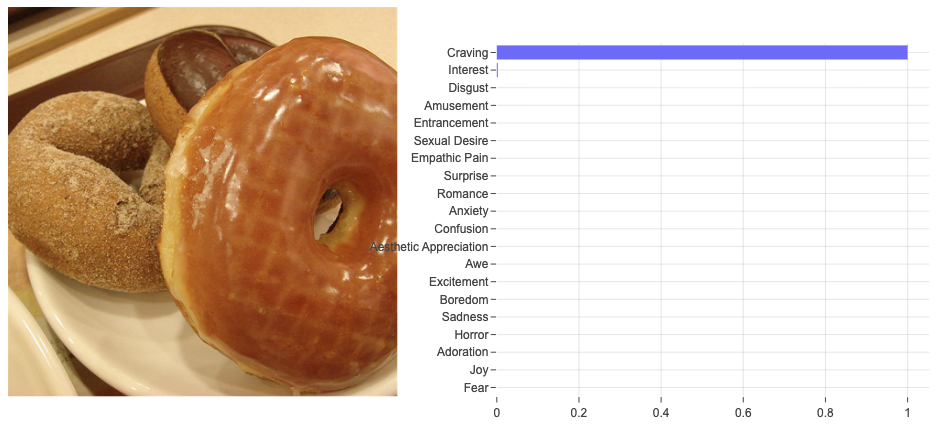
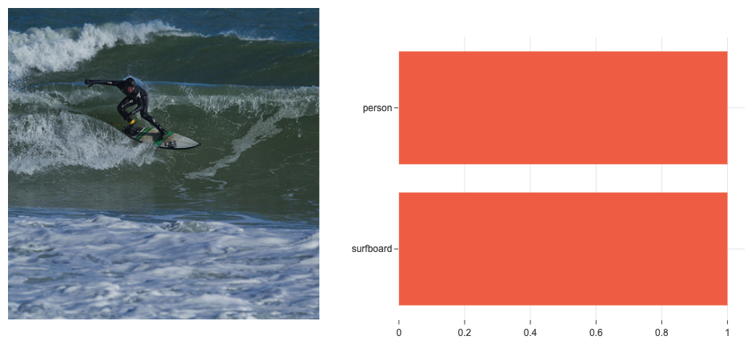
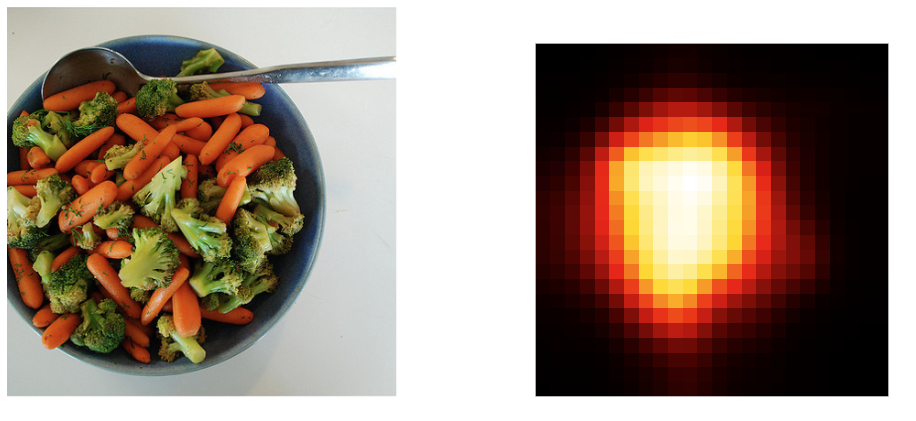
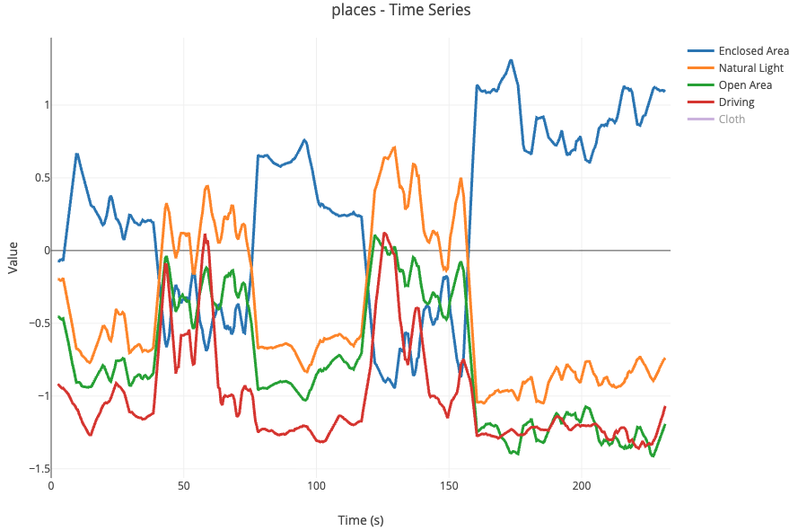
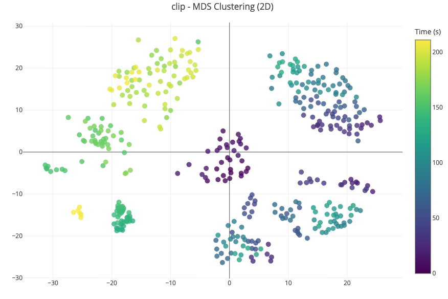
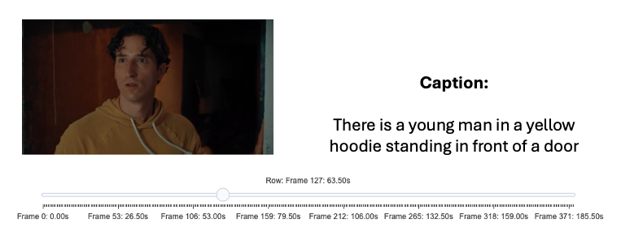

# viz2psy

This is a toolbox meant to enable bulk calculation and exploration of psychological features of images and/or movie frames. Features are extracted from images using a command line interface which wraps multiple computational models used in computer vision and human psychology. Features are stored in tabular format (csv) and a basic html viewer for interacting with the data is provided. Please note that computation of the features from all available models requires a non-trivial amount of dedicated hardware and a moderate-to-fancy workstation or compute cluster is recommended.

## Features

- **11 pre-integrated models** covering memorability, emotion, semantics, captioning, saliency, and more
- **Unified CLI** for images, videos, and HDF5 image bricks
- **Interactive visualizations** with Plotly-based dashboards
- **Metadata sidecar files** documenting outputs and feature definitions

## Installation

```bash
pip install viz2psy
```

Or from source:

```bash
git clone https://github.com/bhutch/viz2psy.git
cd viz2psy
pip install -e .
```

## Quick Start

```bash
# Score images with multiple models
viz2psy resmem clip emonet images/*.jpg -o scores.csv

# Score video frames
viz2psy resmem movie.mp4 --frame-interval 1.0 -o scores.csv

# Visualize results
viz2psy-viz image scores.csv --browse --image-root ./images -o viewer.html
```

```python
from viz2psy.models.resmem import ResMemModel
from viz2psy.pipeline import score_images

model = ResMemModel()
df = score_images(model, ["photo1.jpg", "photo2.jpg"])
```

## Example Outputs

### Image Analysis

| Emotions (EmoNet) | Object Detection (YOLO) | Saliency Map |
|:-----------------:|:-----------------------:|:------------:|
|  |  |  |

### Video/Timeseries Analysis

| Scene Categories (Places) | Semantic Clustering (CLIP) | Captions (BLIP) |
|:-------------------------:|:--------------------------:|:---------------:|
|  |  |  |

## Documentation

| Document | Description |
|----------|-------------|
| [CLI](docs/cli.md) | `viz2psy` command line reference |
| [Models](docs/models.md) | Available models, outputs, and references |
| [Visualization](docs/visualization.md) | `viz2psy-viz` CLI and interactive features |
| [API](docs/api.md) | Python API reference |
| [Changelog](CHANGELOG.md) | Version history and release notes |

## Available Models

| Model | Output | Description |
|-------|--------|-------------|
| `resmem` | 1 score | Image memorability |
| `emonet` | 20 scores | Emotion probabilities |
| `clip` | 512 dims | Vision-language embeddings |
| `caption` | 1 caption | Natural language image captions (BLIP) |
| `dinov2` | 768 dims | Self-supervised features |
| `gist` | 512 dims | Spatial envelope |
| `places` | 467 scores | Scene categories + attributes |
| `llstat` | 17 scores | Low-level statistics |
| `saliency` | 576 dims | Fixation density grid |
| `aesthetics` | 1 score | Aesthetic quality |
| `yolo` | 85 scores | Object detection counts |

See [docs/models.md](docs/models.md) for detailed documentation.

## Hardware Requirements

- **GPU**: NVIDIA (CUDA) or Apple Silicon (MPS) recommended; CPU fallback supported but significantly slower
- **VRAM**: 8GB minimum for most models; 12GB+ recommended for running multiple models
- **RAM**: 16GB minimum, 32GB recommended for parallel model execution (`--parallel`)
- **Disk**: ~10GB for model weights (downloaded automatically on first use)
- **Output**: ~60MB per 1000 images when using all models (~2900 feature columns)

## Citation

If you use viz2psy in your research, please cite the relevant model papers:

- **ResMem**: Needell & Bainbridge (2022). *Computational Brain & Behavior*.
- **EmoNet**: Kragel et al. (2019). *Science Advances*.
- **CLIP**: Radford et al. (2021). *ICML*.
- **BLIP**: Li et al. (2022). *ICML*.
- **DINOv2**: Oquab et al. (2023). *arXiv*.
- **GIST**: Oliva & Torralba (2001). *International Journal of Computer Vision*.
- **Places365**: Zhou et al. (2017). *IEEE TPAMI*.
- **LLStat**: Hasler & Suesstrunk (2003). *SPIE*. (colorfulness metric)
- **DeepGaze IIE** (saliency): Kümmerer et al. (2022). *Journal of Vision*.
- **LAION Aesthetics**: Schuhmann et al. (2022). *NeurIPS Datasets*.
- **YOLOv8**: Jocher et al. (2023). Ultralytics.

## License

MIT License. See [LICENSE](LICENSE) for details.
