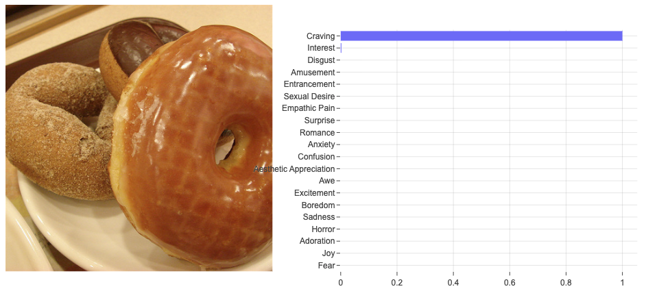
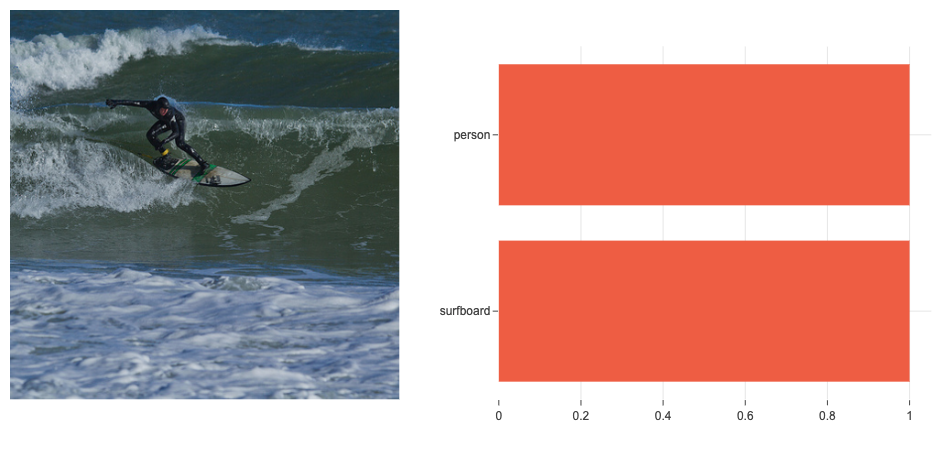
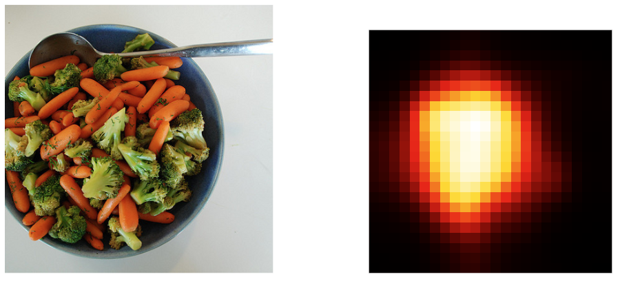
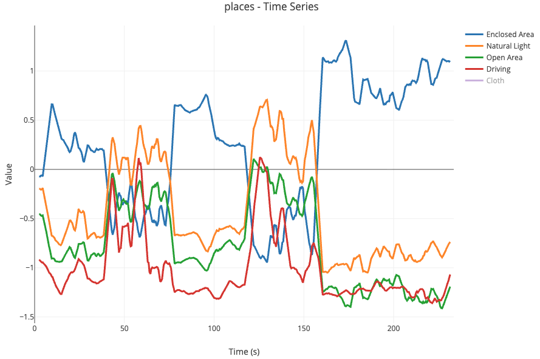
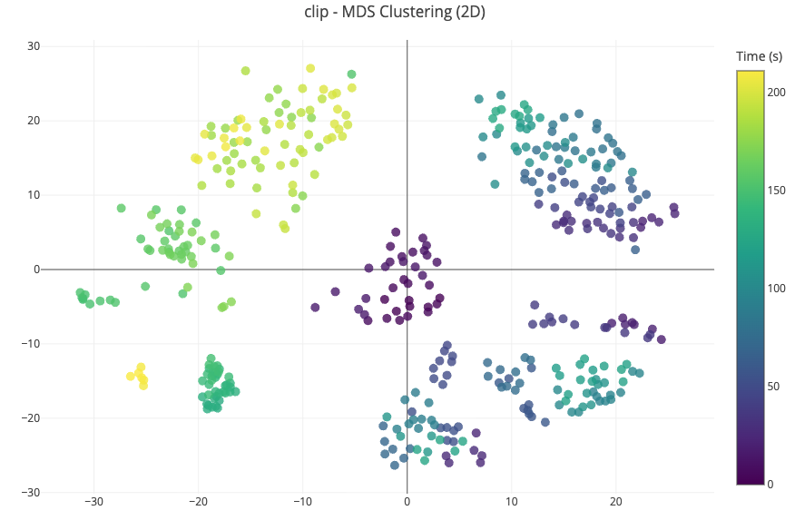
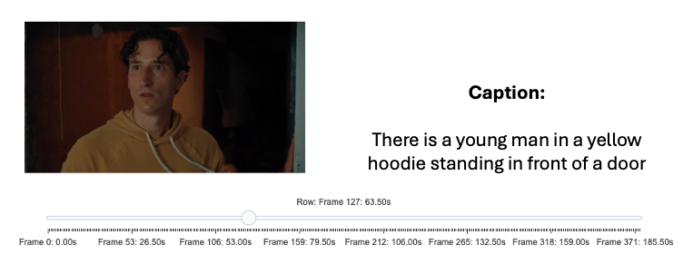

# viz2psy

This is a toolbox meant to enable bulk calculation and exploration of psychological features of images and/or movie frames. Features are extracted from images using a command line interface which wraps multiple computational models used in computer vision and human psychology. Features are stored in tabular format (csv) and a basic html viewer for interacting with the data is provided. Please note that computation of the features from all available models requires a non-trivial amount of dedicated hardware and a moderate-to-fancy workstation or compute cluster is recommended.

## Features

- **12 pre-integrated models** covering memorability, emotion, semantics, captioning, saliency, cross-modal embeddings, and more
- **Unified CLI** for images, videos, and HDF5 image bricks
- **Interactive visualizations** with Plotly-based dashboards
- **Metadata sidecar files** documenting outputs and feature definitions

## Installation

viz2psy is not yet on PyPI; install from GitHub:

```bash
pip install "viz2psy @ git+https://github.com/hulacon/viz2psy"
```

Or from a clone:

```bash
git clone https://github.com/hulacon/viz2psy.git
cd viz2psy
pip install -e .
```

Two models need optional extras (their dependencies are not installed by default):

```bash
pip install "viz2psy[caption] @ git+https://github.com/hulacon/viz2psy"   # BLIP captions (transformers)
pip install "viz2psy[ebind] @ git+https://github.com/hulacon/viz2psy"     # EBind embeddings
```

Note the `ebind` extra installs the [EBind package](https://github.com/encord-team/ebind)
from GitHub; its model weights are licensed CC-BY-NC-SA 4.0 (non-commercial).

## Quick Start

```bash
# Score images with multiple models
viz2psy resmem clip emonet images/*.jpg -o scores.csv

# Score video frames
viz2psy resmem movie.mp4 --frame-interval 1.0 -o scores.csv

# Visualize results
viz2psy-viz image scores.csv --browse --image-root ./images -o viewer.html
```

```python
from viz2psy.models.resmem import ResMemModel
from viz2psy.pipeline import score_images

model = ResMemModel()
df = score_images(model, ["photo1.jpg", "photo2.jpg"])
```

## Example Outputs

### Image Analysis

| Emotions (EmoNet) | Object Detection (YOLO) | Saliency Map (DeepGaze IIE) |
|:-----------------:|:-----------------------:|:------------:|
|  |  |  |

### Video/Timeseries Analysis

| Scene Categories (Places) | Semantic Clustering (CLIP) | Captions (BLIP) |
|:-------------------------:|:--------------------------:|:---------------:|
|  |  |  |

## Documentation

| Document | Description |
|----------|-------------|
| [CLI](docs/cli.md) | `viz2psy` command line reference |
| [Models](docs/models.md) | Available models, outputs, and references |
| [Visualization](docs/visualization.md) | `viz2psy-viz` CLI and interactive features |
| [API](docs/api.md) | Python API reference |
| [Changelog](CHANGELOG.md) | Version history and release notes |

## Available Models

| Model | Output | Description |
|-------|--------|-------------|
| `resmem` | 1 score | Image memorability |
| `emonet` | 20 scores | Emotion probabilities |
| `clip` | 512 dims | Vision-language embeddings (OpenCLIP) |
| `ebind` | 1024 dims | Cross-modal EBind embeddings, shared space with text and audio (see below) |
| `caption` | 1 caption | Natural language image captions (BLIP) |
| `dinov2` | 768 dims | Self-supervised features |
| `gist` | 512 dims | Spatial envelope |
| `places` | 467 scores | Scene categories + attributes |
| `llstat` | 17 scores | Low-level statistics |
| `saliency` | 576 dims | Fixation density grid |
| `aesthetics` | 1 score | Aesthetic quality |
| `yolo` | 85 scores | Object detection counts |
| `motion` | 7 scores | Optical-flow motion statistics — **video only** (energy, coherence, pan/tilt, radial looming, frame difference; Farnebäck flow between native-adjacent frames at each grid timestamp, in frame-heights/s) |
| `faces` | 5 scores | Face count/size/configuration (OpenCV YuNet): count, total/max area, framing, face clustering |
| `depth` | 6 scores | Scene layout from monocular relative depth (Depth Anything V2 small): foreground fraction, openness, spread/skew, depth clutter, composition — all invariant to the per-image depth normalization |

See [docs/models.md](docs/models.md) for detailed documentation.

## Hardware Requirements

- **GPU**: NVIDIA (CUDA) or Apple Silicon (MPS) recommended; CPU fallback supported but significantly slower
- **VRAM**: 8GB minimum for most models; 12GB+ recommended for running multiple models
- **RAM**: 16GB minimum, 32GB recommended for parallel model execution (`--parallel`)
- **Disk**: ~10GB for model weights (downloaded automatically on first use)
- **Output**: ~60MB per 1000 images when using all models (~2900 feature columns)

## Related packages

viz2psy is the visual member of a family of stimulus feature extractors that share
one output convention (per-model column prefixes, `stimulus_id` keys, provenance
sidecars):

| Package | Modality |
|---------|----------|
| [viz2psy](https://github.com/hulacon/viz2psy) | Images and video frames (this package) |
| [aud2psy](https://github.com/hulacon/aud2psy) | Audio and speech |
| [word2psy](https://github.com/hulacon/word2psy) | Words and text |
| [psytwill](https://github.com/hulacon/psytwill) | Downstream consumer: combines and compares features across the three extractors |

Two viz2psy models produce embeddings directly comparable across packages:
`clip` shares a 512-d image–text space with word2psy `clip_text`, and `ebind`
shares a 1024-d image–text–audio space with word2psy `ebind_text` and aud2psy
`ebind_audio` (all three use the same `encord-team/ebind-full` checkpoint).

## Citing

To cite viz2psy itself, see [CITATION.cff](CITATION.cff) (GitHub's "Cite this
repository" button renders it).

If you use viz2psy in your research, please also cite the papers behind the
models you used:

- **ResMem** (`resmem`): Needell, C. D., & Bainbridge, W. A. (2022). Embracing new techniques in deep learning for estimating image memorability. *Computational Brain & Behavior, 5*, 168–184. [doi:10.1007/s42113-022-00126-5](https://doi.org/10.1007/s42113-022-00126-5)
- **EmoNet** (`emonet`): Kragel, P. A., Reddan, M. C., LaBar, K. S., & Wager, T. D. (2019). Emotion schemas are embedded in the human visual system. *Science Advances, 5*(7), eaaw4358. [doi:10.1126/sciadv.aaw4358](https://doi.org/10.1126/sciadv.aaw4358)
- **CLIP** (`clip`, architecture): Radford, A., et al. (2021). Learning transferable visual models from natural language supervision. *ICML 2021*. [arXiv:2103.00020](https://arxiv.org/abs/2103.00020)
- **OpenCLIP / LAION-2B** (`clip`, the actual weights, `laion2b_s34b_b79k`): Cherti, M., et al. (2023). Reproducible scaling laws for contrastive language-image learning. *CVPR 2023*. [arXiv:2212.07143](https://arxiv.org/abs/2212.07143); Ilharco, G., et al. (2021). OpenCLIP. [doi:10.5281/zenodo.5143773](https://doi.org/10.5281/zenodo.5143773)
- **EBind** (`ebind`): Broadbent, J., Cohen, F., Hvilshøj, F., Landau, E., & Sasoglu, E. (2025). EBind: A practical approach to space binding. [arXiv:2511.14229](https://arxiv.org/abs/2511.14229). Vision arm is the Perception Encoder: Bolya, D., et al. (2025). Perception Encoder: The best visual embeddings are not at the output of the network. *NeurIPS 2025*. [arXiv:2504.13181](https://arxiv.org/abs/2504.13181)
- **BLIP** (`caption`): Li, J., Li, D., Xiong, C., & Hoi, S. (2022). BLIP: Bootstrapping language-image pre-training for unified vision-language understanding and generation. *ICML 2022*. [arXiv:2201.12086](https://arxiv.org/abs/2201.12086)
- **DINOv2** (`dinov2`): Oquab, M., et al. (2024). DINOv2: Learning robust visual features without supervision. *TMLR*. [arXiv:2304.07193](https://arxiv.org/abs/2304.07193)
- **GIST** (`gist`): Oliva, A., & Torralba, A. (2001). Modeling the shape of the scene: A holistic representation of the spatial envelope. *International Journal of Computer Vision, 42*, 145–175. [doi:10.1023/A:1011139631724](https://doi.org/10.1023/A:1011139631724)
- **Places365** (`places`): Zhou, B., Lapedriza, A., Khosla, A., Oliva, A., & Torralba, A. (2018). Places: A 10 million image database for scene recognition. *IEEE TPAMI, 40*(6), 1452–1464. [doi:10.1109/TPAMI.2017.2723009](https://doi.org/10.1109/TPAMI.2017.2723009)
- **Colorfulness** (`llstat`): Hasler, D., & Suesstrunk, S. E. (2003). Measuring colorfulness in natural images. *SPIE Human Vision and Electronic Imaging VIII*. [doi:10.1117/12.477378](https://doi.org/10.1117/12.477378)
- **DeepGaze IIE** (`saliency`): Linardos, A., Kümmerer, M., Press, O., & Bethge, M. (2021). DeepGaze IIE: Calibrated prediction in and out-of-domain for state-of-the-art saliency modeling. *ICCV 2021*. [arXiv:2105.12441](https://arxiv.org/abs/2105.12441)
- **LAION Aesthetics** (`aesthetics`): Schuhmann, C., et al. (2022). LAION-5B: An open large-scale dataset for training next generation image-text models. *NeurIPS 2022 Datasets and Benchmarks*. [arXiv:2210.08402](https://arxiv.org/abs/2210.08402); predictor head from [improved-aesthetic-predictor](https://github.com/christophschuhmann/improved-aesthetic-predictor)
- **YOLOv8** (`yolo`): Jocher, G., Chaurasia, A., & Qiu, J. (2023). Ultralytics YOLOv8 (software). [github.com/ultralytics/ultralytics](https://github.com/ultralytics/ultralytics)

## License

MIT License. See [LICENSE](LICENSE) for details.
